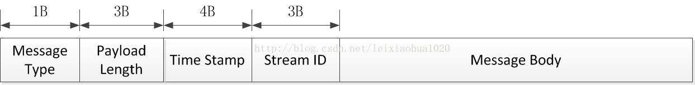
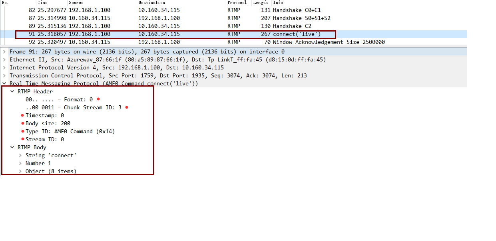
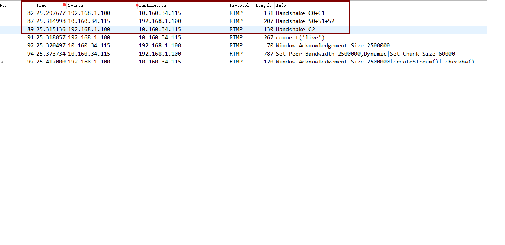
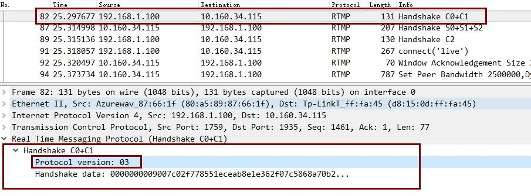
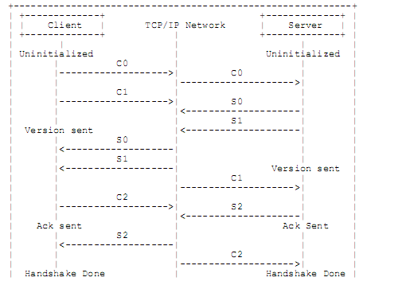

[TOC]
# 块流

## 1.简介
文档规定实时消息协议块流（RTMP 块流）。分块为更高层的多媒体流协议提供复用和分组服务。</br>

虽然RTMP块流是为协同RTMP协议工作而设计的，但是它仍然可以处理任何发送消息流的协议。
每个消息包含时间戳和负载类型标志。RTMP块流和RTMP共同适用于各种形式的音视频应用，
从点到点和点到多的实时直播，到vod服务，到交互式视频会议。</br>

当配合像[TCP]这样的可靠传输协议使用时，RTMP块流保证跨流的所有消息按时间戳序列一个接一个地传输。RTMP块流不提供优先级或类似的控制，但是可以通过更高层的协议提供类似的服务。
例如，视频直播服务可以基于每个消息的发送时间和答复时间选择丢弃视频消息，使慢的客户端能及时接受到音频消息。</br>
RTM块流包含自己的带内协议控制消息，并且提供了让更高层的协议嵌入用户控制消息的机制。

### 1.1 术语
本文档中的关键词”必须”、”一定不”、”要求”、”可以”、”不可以”、”应该”、”不应该”、”建议”、”可能”和”可选”的解释参考文档[BCP14][RFC2119]。

## 2.定义
- **负载**：分组中所包含的数据。例如音频样本和压缩视频数据。负载格式和解释不在本文档的描述范围之内。
- **分组**：一个数据分组由固定的头和负载数据组成。一些底层协议可能需要定义分组的封装。
- **端口**：在一个给定计算机中区分不同目标的抽象。在TCP/IP协议中用一个小的整数来表示端口。OSI中的传输选择器等同于端口的概念。
- **传输地址**：用于表示一个传输层终端的网络地址和端口的组合。例如IP地址和TCP端口。分组从源地址传输到目标地址。
- **消息流**：允许消息流动的逻辑上的通讯通道
- **消息流ID**： 每个消息所关联的ID，用于区分其所在的消息流。
- **块**：一个消息片段。消息通常在被放到网络上传输之前被分成小的部分并且被交错存取。分块确保跨流的所有消息按时间戳顺序被不断的传输。
- **块流**：允许块按照某一方向流动的逻辑上的通讯通道。块流可以从客户端流向服务端，也可以从服务端流向客户端。
- **块流ID**：每个块所关联的用于区分其所在块流的ID。
- **复用**：把分开的音视频数据整合到一个数据流，让多个音视频流可以同步地传输的过程。
- **解复用**：复用的反向过程。交互的音视频数据被收集成原始的音频数据和视频数据。

## 3. 字节序、对齐和时间格式
所有完整的字段都是按网络字节序被承载的，即，零字节是第一个字节，零位是一个字或字段中最显著的位。这种字节序就是所谓的”big-endian”。这种传输顺序的详细描述见[STD5]。除非另行说明，本文档中的数字都是十进制数。</br>

在没有特别说明的情况下RTMP块流中的所有数据都是按字节对齐的。例如，一个16位字段可能在奇数字节偏移的位置。在标有延拓的地方，延拓字节应赋予零值。</br>

RTMP块流中的时间戳是用整数表示的，以毫秒为单位的相对时间，相对于一个未规定的起始时间。一般，每个块流的时间戳都从0开始，但是只要通讯的双方用统一的起始时间，可以不使用这种方法。要注意的是，这样跨多个块流（特别是不同主机之间）的同步需要用另外的机制来实现。

时间戳必须是单调递增的，并且是线性增长的。这样可以使应用程序处理同步，测量带宽，注入检测和进行流控制。</br>

因为时间戳只有32位长，所以只能在50天以内循环。但是，因为流是可以不断的运行的，潜在地可以多年才结束？，所以RTMP块流应用程序必须对减法和比较使用模运算，并且能够处理这种回绕。只要通讯双方一致，任何合理的方法都可使用。例如，一个应用程序可以假设，相邻的时间戳是2^31毫秒，那么1000在4000000000之后，3000000000在4000000000之前。

时间戳增量也是以毫秒为单位的无符号整数。时间戳增量可以是24位或32位长。

## 4. 消息格式（Message Format）
消息格式依赖于上层协议，可以被分成多个块以支持复用。但是消息格式必须包含下面这些创建块所必须的字段。
1. **时间戳(Timestamp)**</br>
    消息的时间戳，占用4个字节
2. **长度（Length）**</br>
    消息负载的长度，如果消息头无法被消减的话，应该包含在长度里，这个字段在块头中占3个字节。
3. **类型ID(Type Id:)**</br>
    一些类型ID是为消息控制协议保留的。这些ID繁衍供RTMP块流协议和高层协议使用的信息。所有其他的ID都用于更高层协议。RTMP块流协议对这些ID做不透明处理。事实上，RTMP块流协议不需要用本字段的值来区分类型；所有消息可以是同类型的，或者应用可以使用本字段来区分同步轨道而不是区分类型。本字段占1个字节。
4. **消息流ID(Message Stream ID)**</br>
    消息流ID可以是任何的值。被复用到相同的块流的消息流依靠其消息ID来解复用。除此之外，对于RTMP块流协议来说，这个值是不透明的。这个值在块头中占4个字节，并且使用小字节序。
    
### 4.1 消息格式的图示
</br>
ps:图片来自网络
### 4.2 抓包看消息
</br>

## 5. 握手（Handshake）
 一个RTMP连接以握手开始。这里的握手和其他协议的握手不一样。这里的握手由三个固定大小的块组成，而不是可变大小的块加上头。
客户端（发起连接的一方）和服务端各自发送三个相同的块。这些块如果是客户端发送的话记为C0，C1和C2，如果是服务端发送的话记为S0，S1和S2。
### 5.1 握手队列（Handshake sequence）
1. 握手开始于客户端发送C0，C1块。
2. 在发送C2之前客户端必须等待接收S1 。
3. 在发送任何其他数据之前客户端必须等待接收S2。
4. 服务端在发送S0和S1之前必须等待接收C0，也可以等待接收C1。
5. 服务端在发送S2之前必须等待接收C1。
6. 服务端在发送任何数据之前必须等待接收C2。

#### 5.1.1 抓包看
</br>

### 5.2 C0和C1的消息格式（C0 and S0 Format）
C0和S0是单独的一个字节 。
```$xslt
0 1 2 3 4 5 6 7
+-+-+-+-+-+-+-+-+
|     version   |
+-+-+-+-+-+-+-+-+
```
**下面是C0和S0包的字段说明。**</br>
- version：8位</br>
    在C0中这个字段表示客户端要求的RTMP版本 。在S0中这个字段表示服务器选择的RTMP版本。本规范所定义的版本是3；0-2是早期产品所用的，已被丢弃；4-31保留在未来使用 ；32-255不允许使用 （为了区分其他以某一字符开始的文本协议）。如果服务无法识别客户端请求的版本，应该返回3 。客户端可以选择减到版本3或选择取消握手。
#### 5.2.1 抓包看

### 5.3 C1和S1消息格式(C1 and S1 Format)
C1和S1消息有1536字节长，由下列字段组成。
```$xslt
 0                   1                   2                   3
 0 1 2 3 4 5 6 7 8 9 0 1 2 3 4 5 6 7 8 9 0 1 2 3 4 5 6 7 8 9 0 1
+-+-+-+-+-+-+-+-+-+-+-+-+-+-+-+-+-+-+-+-+-+-+-+-+-+-+-+-+-+-+-+-+
|                           time (4 bytes)                      |
+-+-+-+-+-+-+-+-+-+-+-+-+-+-+-+-+-+-+-+-+-+-+-+-+-+-+-+-+-+-+-+-+
|                           zero (4 bytes)                      |
+-+-+-+-+-+-+-+-+-+-+-+-+-+-+-+-+-+-+-+-+-+-+-+-+-+-+-+-+-+-+-+-+
|                           random bytes                        |
+-+-+-+-+-+-+-+-+-+-+-+-+-+-+-+-+-+-+-+-+-+-+-+-+-+-+-+-+-+-+-+-+
|                           random bytes                        |
|                               (cont)                          |
|                           ....                                |
+-+-+-+-+-+-+-+-+-+-+-+-+-+-+-+-+-+-+-+-+-+-+-+-+-+-+-+-+-+-+-+-+
```
- Time: 4 bytes</br>
本字段包含时间戳。该时间戳应该是发送这个数据块的端点的后续块的时间起始点。可以是0，或其他的任何值。为了同步多个流，端点可能发送其块流的当前值。
- Zero: 4 bytes</br>
本字段必须是全零。
- Random data: 1528 bytes</br>
本字段可以包含任何值。因为每个端点必须用自己初始化的握手和对端初始化的握手来区分身份，所以这个数据应有充分的随机性。但是并不需要加密安全的随机值，或者动态值。

### 5.4 C2 和 S2 消息格式(C2 and S2 Format)
C2和S2消息有1536字节长。只是S1和C1的回复。本消息由下列字段组成。
```$xslt
 0                   1                   2                   3
 0 1 2 3 4 5 6 7 8 9 0 1 2 3 4 5 6 7 8 9 0 1 2 3 4 5 6 7 8 9 0 1
+-+-+-+-+-+-+-+-+-+-+-+-+-+-+-+-+-+-+-+-+-+-+-+-+-+-+-+-+-+-+-+-+
|                       time (4 bytes)                          |
+-+-+-+-+-+-+-+-+-+-+-+-+-+-+-+-+-+-+-+-+-+-+-+-+-+-+-+-+-+-+-+-+
|                       time2(4 bytes)                          |
+-+-+-+-+-+-+-+-+-+-+-+-+-+-+-+-+-+-+-+-+-+-+-+-+-+-+-+-+-+-+-+-+
|                       random echo                             |
+-+-+-+-+-+-+-+-+-+-+-+-+-+-+-+-+-+-+-+-+-+-+-+-+-+-+-+-+-+-+-+-+
|                       random echo                             |
|                       (cont)                                  |
|                       ....                                    |
+-+-+-+-+-+-+-+-+-+-+-+-+-+-+-+-+-+-+-+-+-+-+-+-+-+-+-+-+-+-+-+-+
```
- time 4bytes</br>
    本字段必须包含对等段发送的时间（对C2来说是S1，对S2来说是C1）。
- time2 4bytes</br>
    本字段必须包含先前发送的并被对端读取的包的时间戳。
- randmon echo 1528bytes</br>
    本字段必须包含对端发送的随机数据字段（对C2来说是S1，对S2来说是C1）。
    每个对等端可以用时间和时间2字段中的时间戳来快速地估计带宽和延迟。但这样做可能并不实用。
     
### 5.5 握手示意图


 


 
    


